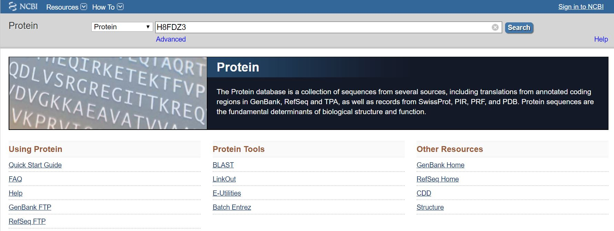
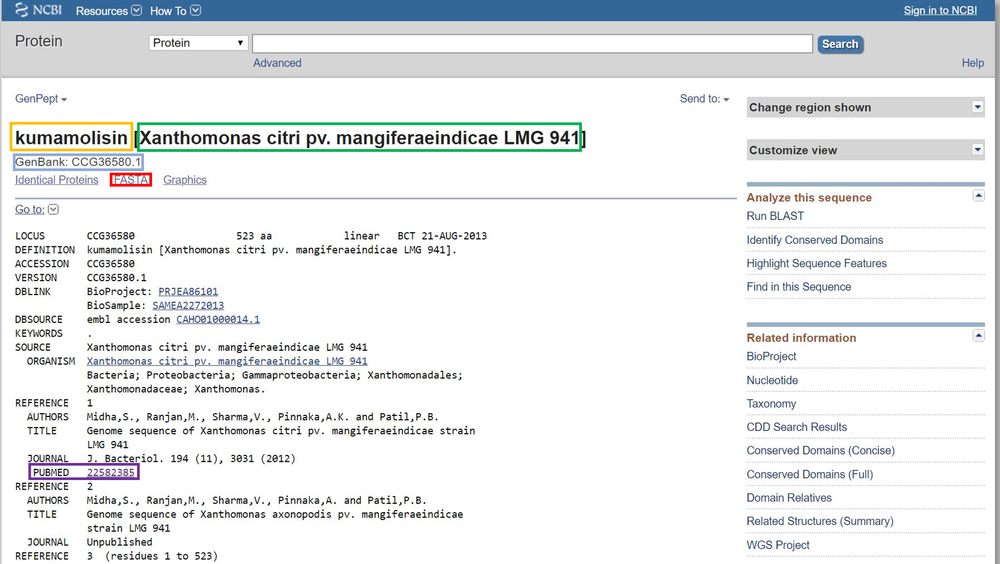
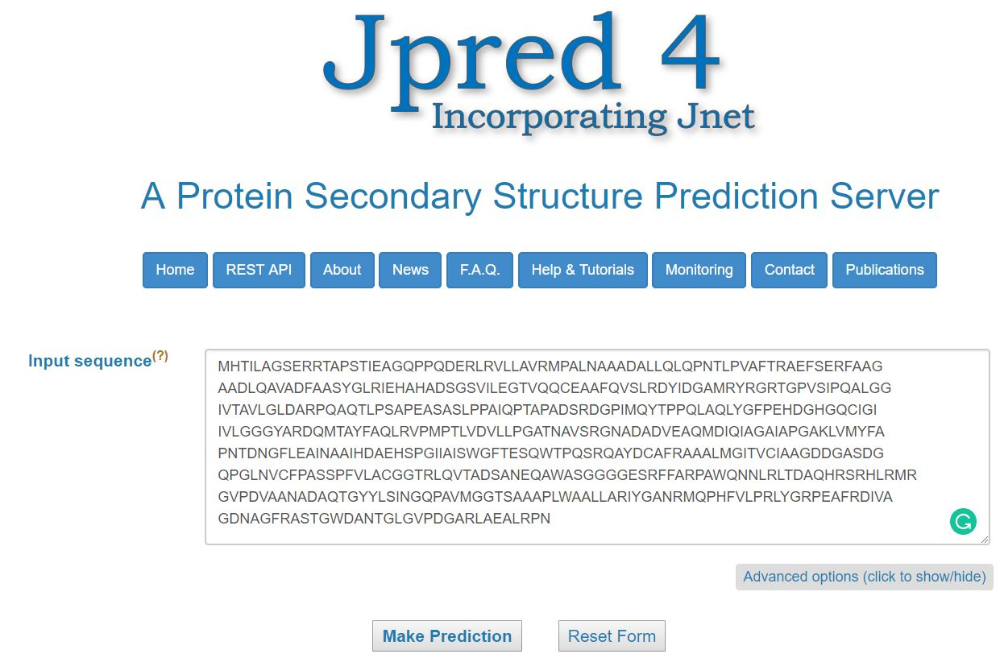
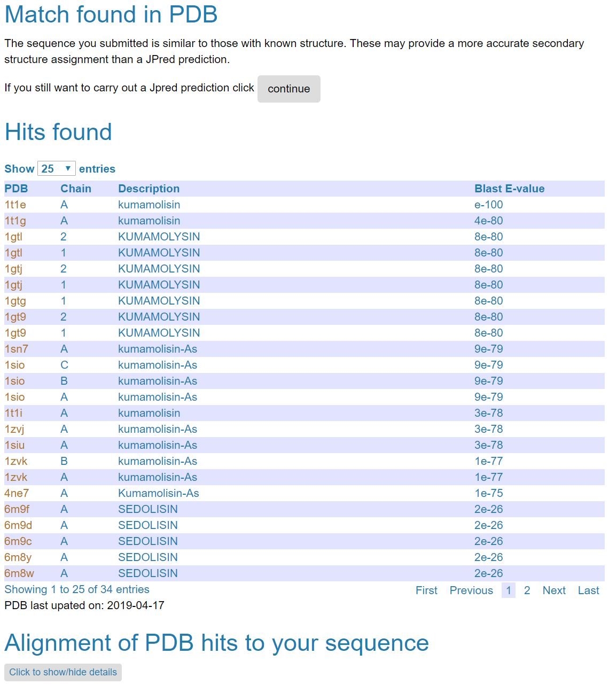
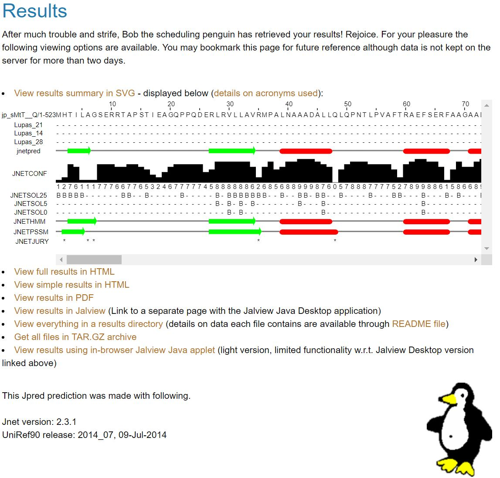
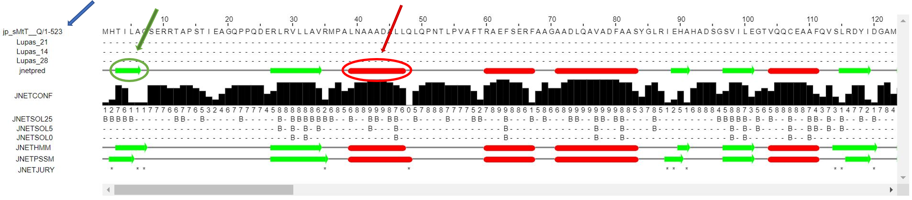
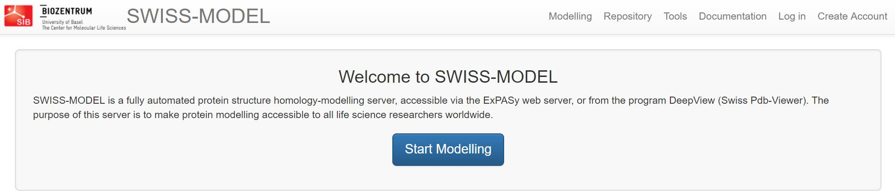
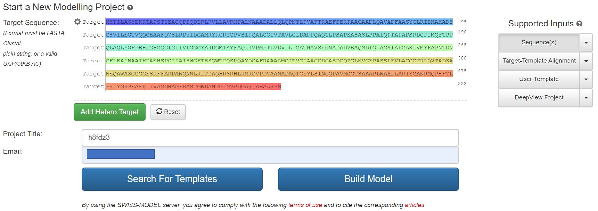
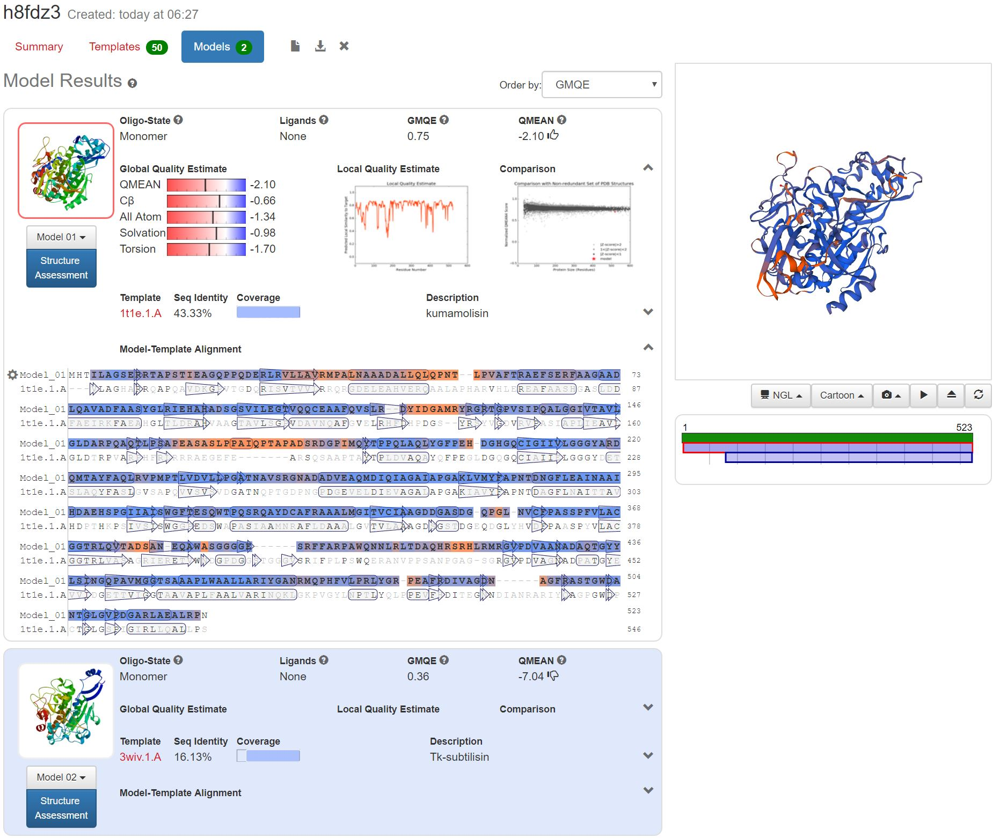
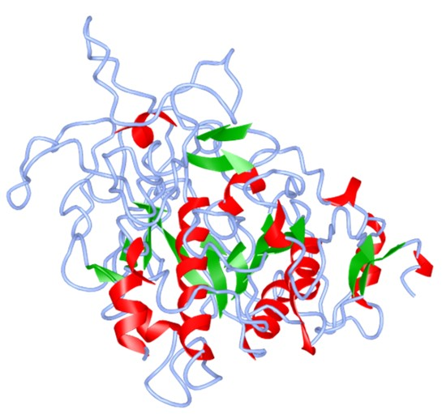

# binf630hw2.github.io
BINF 630 Homework 2
<!DOCTYPE html PUBLIC "-//W3C//DTD HTML 4.01 Transitional//EN">
<html>
  <head>
    <meta http-equiv="content-type" content="text/html; charset=UTF-8">
    <title>BINF630_hw2</title>
    
    </head>
  <body>
    
<strong>BINF630 Homework 2</strong> 
        <em>Chih Hao Huang</em> 
       
      

      

		  <strong>Basic Information</strong> Protein ID assigned: <a
        href="https://www.ncbi.nlm.nih.gov/protein/380688664">
		  H8FDZ3</a> 
		  Protein: kumamolisin 
          Organism: Xanthomonas citri pv. mangiferaeindicae LMG 941 
          GenBank ID: 
		  <a href="https://www.ncbi.nlm.nih.gov/protein/CCG36580.1">
		  CCG36580.1</a> 
		  PUBMED: 
		  <a href="https://www.ncbi.nlm.nih.gov/pubmed/22582385">
		  22582385</a> 
          <a href="fasta.html">FASTA file</a>  
		  

		      
		  
<strong>Collect information for protein ID H8FDZ3</strong>

		  
1. Go to 
		  <a href="https://www.ncbi.nlm.nih.gov/protein/">
		  NCBI 
Protein website</a> and search H8FDZ3

		  

		  

		  
2. After pressing "Search" button, it will take you 
directly to <a href="https://www.ncbi.nlm.nih.gov/protein/380688664">
		  this website</a>

		  

		  

		  
3. From here I found the 
		  protein, 
		  organism, 
		  GenBank ID, 
		  PubMed ID, and 
		  FASTA file.

		  

		  &nbsp;

		  

		  &nbsp;

      

    

	
<strong>Secondary Structure:</strong>

	
<strong><a href="http://www.compbio.dundee.ac.uk/jpred/">Jpred 4</a></strong>

	
1. Go to <a href="http://www.compbio.dundee.ac.uk/jpred/">Jpred 4</a> and 
	paste in the FASTA sequence

	

	

	
2. Click "Make Prediction" button without making any changes to the 
	settings. Result shown below:

	

	

	
3. Now click on the "continue" button, and this is the
	<a href="http://www.compbio.dundee.ac.uk/jpred4/results/jp_sMtT__Q/jp_sMtT__Q.results.html">
	result</a> that you will see after the analysis is done:

	

	

	
&nbsp;Part of the result shown below, full image available
	<a href="http://www.compbio.dundee.ac.uk/jpred4/results/jp_sMtT__Q/jp_sMtT__Q.svg.html">
	here</a>:

	

	

	
The first line is our sequence, and the
	green arrows in the figure indicate 
	
	α-helixes 
	and the 
	
	red bars indicate β-sheets.

	
&nbsp;

	
<strong>Secondary Structure and Tertiary Structure:</strong>

	
Swiss-Model was used to generate secondary structure in 3D using homology 
	modeling algorithm.

	
<strong><a href="https://swissmodel.expasy.org/">Swiss Model</a></strong>

	
1. Go to the <a href="https://swissmodel.expasy.org/">Swiss Model</a> 
	Website and click on "Start Modelling"

	

	

	
2. Paste the FASTA file into the "Target Seuqence" box, add a project 
	title (in this case, I used the protein ID), add my E-mail and click on 
	"Build Model" button (all the other settings stay as default).

	

	

	
3. <a href="https://swissmodel.expasy.org/interactive/KCA6Hk/models/">
	Result</a> show as below:

	

	

	
Two models were generated from Swiss model, and the model is displaying&nbsp; 
	on the right (in the screenshot its the first model). 

	
&nbsp;

	
4. PDB model can be loaded into the window below. Once loaded, go to 
	"Color" tab, and change to secondary, sheet in green. 

	
First model:
	<a href="https://swissmodel.expasy.org/interactive/KCA6Hk/models/01.pdb">
	PDB</a>

	
Second model:
	<a href="https://swissmodel.expasy.org/interactive/KCA6Hk/models/02.pdb">
	PDB</a>

	
<iframe src="https://icn3d.page.link/vQgAmi23Vu4EwVdS8" width="1200" height="1000" style="border:none"></iframe>

	
&nbsp;

	
Screenshot of them:

	
1st model:

	

	
2nd model

	

	
Green arrows in the figures above indicate
	
	
	α-helixes 
	and the 
	
	red sheets indicate β-sheets.

	
&nbsp;

	
&nbsp;

	
&nbsp;

	
Quality of the Model:

	
&nbsp;

	
&nbsp;

	
Structural Classification of Model:

	
&nbsp;

	
&nbsp;

  </body>
</html>
