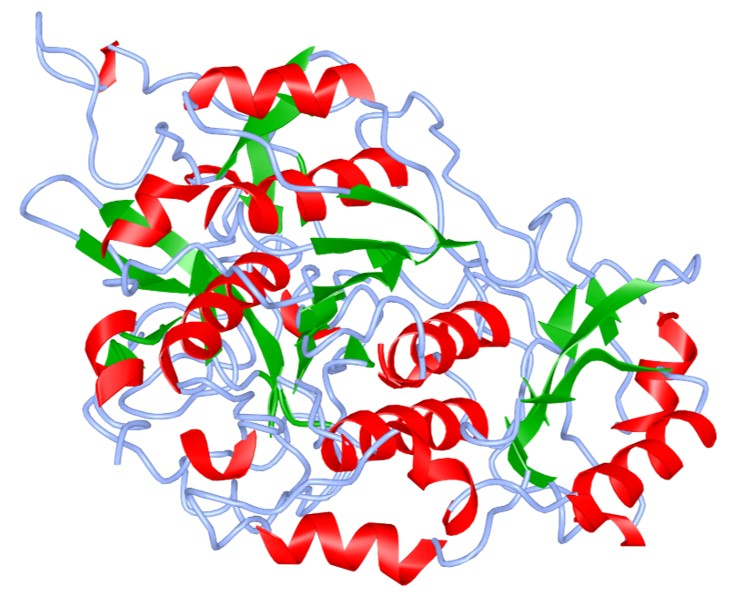
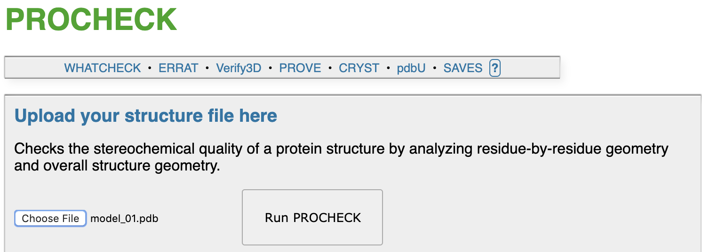

<!DOCTYPE html PUBLIC "-//W3C//DTD HTML 4.01 Transitional//EN">
<html>
  <head>
    <meta http-equiv="content-type" content="text/html; charset=UTF-8">
    <title>BINF630_hw2</title>
    
    </head>
  <body>
    

		<h2><strong>BINF630 Homework 2</strong> 
        </h2>
		<h3 class="auto-style17">
        <em>Chih Hao Huang</em></h3>
		 
       
      

      	<h3>
		  <strong>A. Basic Information</strong></h3>
		   Protein ID assigned: <a
        href="https://www.ncbi.nlm.nih.gov/protein/380688664">
		  H8FDZ3</a> 
		  Protein: kumamolisin 
          Organism: Xanthomonas citri pv. mangiferaeindicae LMG 941 
          GenBank ID: 
		  <a href="https://www.ncbi.nlm.nih.gov/protein/CCG36580.1">
		  CCG36580.1</a> 
		  PUBMED: 
		  <a href="https://www.ncbi.nlm.nih.gov/pubmed/22582385">
		  22582385</a> 
          <a href="H8FDZ3.fasta">FASTA file</a>  
		  
1. To collect information for protein ID <a
        href="https://www.ncbi.nlm.nih.gov/protein/380688664">
		  H8FDZ3</a>. Go to 
		  <a href="https://www.ncbi.nlm.nih.gov/protein/">
		  NCBI 
Protein website</a> and search H8FDZ3

		  

		  

		  
2. After pressing "Search" button, it will take you 
directly to <a href="https://www.ncbi.nlm.nih.gov/protein/380688664">
		  this website</a>

		  

		  

		  
3. From here I found the 
		  protein, 
		  organism, 
		  GenBank ID, 
		  PubMed ID, and 
		  FASTA file.

		  

		  &nbsp;

		  

		  &nbsp;

      

    

	<h3><strong>B. Secondary Structure:</strong></h3>
	
<strong><a href="http://www.compbio.dundee.ac.uk/jpred/">Jpred 4</a> </strong>
	was used to predict secondary structure of assigned protein.

	
1. Go to <a href="http://www.compbio.dundee.ac.uk/jpred/">Jpred 4</a> and 
	paste in the FASTA sequence

	

	

	
2. Click "Make Prediction" button without making any changes to the 
	settings. Result shown below:

	

	

	
3. Now click on the "continue" button, and this is the
	<a href="http://www.compbio.dundee.ac.uk/jpred4/results/jp_sMtT__Q/jp_sMtT__Q.results.html">
	result</a> that you will see after the analysis is done:

	

	

	
&nbsp;Part of the result shown below, full image available
	<a href="http://www.compbio.dundee.ac.uk/jpred4/results/jp_sMtT__Q/jp_sMtT__Q.svg.html">
	here</a>:

	

	

	
The first line is our sequence, and the
	green arrows in the figure indicate 
	
	α-helixes 
	and the 
	
	red bars indicate β-sheets.

	
&nbsp;

	<h3><strong>C. Secondary Structure and 3D Structure:</strong></h3>
	
<a href="https://swissmodel.expasy.org/"><strong>Swiss Model</strong></a> 
	was used to generate secondary structure in 3D using homology modeling 
	algorithm.

	
1. Go to the <a href="https://swissmodel.expasy.org/">Swiss Model</a> 
	Website and click on "Start Modelling"

	

	

	
2. Paste the FASTA file into the "Target Seuqence" box, add a project 
	title (in this case, I used the protein ID), add my E-mail and click on 
	"Build Model" button (all the other settings stay as default).

	

	

	
3. <a href="https://swissmodel.expasy.org/interactive/KCA6Hk/models/">
	Result</a> show as below:

	

	

	
Two models were generated from Swiss model, and the model is displaying&nbsp; 
	on the right (in the screenshot it's the first model). 

	
&nbsp;

	
4. PDB models can be loaded in<a href="https://www.ncbi.nlm.nih.gov/Structure/icn3d/full.html"> 
	iCn3D</a>. Once loaded, go to 
	"Color" tab, and change to secondary, sheet in green. 

	
&nbsp;&nbsp;&nbsp;&nbsp;&nbsp;&nbsp;&nbsp;&nbsp;&nbsp;&nbsp;&nbsp;&nbsp;&nbsp;&nbsp;&nbsp;&nbsp;&nbsp;&nbsp;&nbsp;&nbsp;&nbsp; First model:
	<a href="https://swissmodel.expasy.org/interactive/KCA6Hk/models/01.pdb">
	PDB</a>&nbsp;&nbsp;&nbsp;&nbsp;&nbsp;&nbsp;&nbsp;&nbsp;&nbsp;&nbsp;&nbsp;&nbsp;&nbsp;&nbsp;&nbsp;&nbsp;&nbsp;&nbsp;&nbsp;&nbsp;&nbsp;&nbsp;&nbsp;&nbsp;&nbsp;&nbsp;&nbsp;&nbsp;&nbsp;&nbsp;&nbsp;&nbsp;&nbsp;&nbsp;&nbsp;&nbsp;&nbsp;&nbsp;&nbsp;&nbsp;&nbsp;&nbsp;&nbsp;&nbsp;&nbsp;&nbsp;&nbsp; Second model:
	<a href="https://swissmodel.expasy.org/interactive/KCA6Hk/models/02.pdb">
	PDB</a>

	

	
* Green arrows in the figures above indicate
	
	
	α-helixes 
	and the 
	
	red sheets indicate β-sheets.

	
&nbsp;

	
&nbsp;

	<h3>D. Quality of the Model:</h3>
	
<a href="http://servicesn.mbi.ucla.edu/PROCHECK/"><strong>PROCHECK</strong></a> was used to check the stereochemical quality of our protein 
	structures generated by Swiss-Model by analyzing their residue-by-residue 
	geometry and overall structure geometry.

	
1. Go to <a href="http://servicesn.mbi.ucla.edu/PROCHECK/">PROCHECK</a> 
	and upload models given above (one at a time, will use model 1 as example)

	

	
2. Once done, <a href="http://servicesn.mbi.ucla.edu/PROCHECK/?job=48885">
	result page (for model 1)</a> like this will show up:

	

	
* <a href="http://servicesn.mbi.ucla.edu/PROCHECK/?job=48886">result page 
	for model 2</a>

	
3. First we will look at the "<a href="http://servicesn.mbi.ucla.edu/PROCHECK/Jobs/5219202/5219202_01.pdf">Main 
	Ramachandran plot</a>" in the result page, once click on it, this will show 
	up:

	

	
From the image above, we see red, yellow, light yellow and white regions, 
	these regions indicates favored region, additional allowed region, generally 
	allowed region, and disallowed region, respectfully. As shown under the 
	figure, my model 1 has 1 residue in the disallowed regions, and 88.1% of the 
	residues inside the favored region, which indicates that model 1 has really 
	good quality. In
	<a href="https://servicesn.mbi.ucla.edu/PROCHECK/Jobs/4812707/4812707_01.pdf">
	model 2 Main Ramachandran plot</a>, there are 3 residues in the disallowed 
	region with 82% residues in the favor region. Model 2's quality is fair, but 
	model 1 is better.

	
&nbsp;

	
4. Next we will look at the "<a href="http://servicesn.mbi.ucla.edu/PROCHECK/Jobs/5219202/5219202_04.pdf">Main-chain 
	parameters</a>" and the "<a href="http://servicesn.mbi.ucla.edu/PROCHECK/Jobs/5219202/5219202_05.pdf">Side-chain 
	parameters</a>" (model 1)

	

	
The six parameters that we are testing in Main-chain parameters are
	%-tage residues in A, B, L,
	Omega angle st dev, 
	Bad contacts / 100 residues,
	Zeta angle st dev,
	H-bond energy st dev, and
	Overall G-factor. The five parameters 
	tested in the Side-chain parameters are Chi-1 
	gauche minus st dev, Chi-1 trans st dev,
	Chi-1 gauche plus st dev,
	Chi-1 pooled st dev, and
	Chi-1 trans st dev. In these two analysis, 
	the purple band indicates the expected parameter values, and the black line 
	inside the region is the perfect fit. When our black squares lay inside the 
	purple region, it indicates that the values are expected, the closer to the 
	perfect fit line the better the quality. In model 1 main-chain parameters 
	analysis, all six black squares lays inside the expected region; on the 
	other hand, only Chi-1 gauche minus st dev 
	and Chi-1 trans 
	st dev's value layes in the expected 
	regions, Chi-1 gauche plus st dev,
	Chi-1 pooled st dev, and
	Chi-1 trans st dev parameter values are 
	not as expected. The main-chain has a good quality while the side-chain 
	quality isn't that good. 

	
&nbsp;

	<h3>E. Structural Classification of Model:</h3>
	
<strong><a href="http://www.cathdb.info/">CATH-Gene3D</a></strong>. CATH 
	is a classification of protein structures downloaded from the Protein Data 
	Bank and Gene3D uses the information in CATH to predict the locations of 
	structural domains on millions of protein sequences available in public 
	databases.

	
1. Go to <a href="http://www.cathdb.info/">CATH-Gene3D</a> and search for 
	the protine "kumamolisin".

	

	
2. On the result page

	
&nbsp;

	
3. This will take you to the next step "Submit scan". Click on "View 11 
	sequence hits now"

	
&nbsp;

	
4. 

	
&nbsp;

	
&nbsp;

	
&nbsp;

	
&nbsp;

	
&nbsp;

	
&nbsp;

	
&nbsp;

	
&nbsp;

	
&nbsp;

	
&nbsp;

	
&nbsp;

	
&nbsp;

	
&nbsp;

	
&nbsp;

	</body>
</html>
